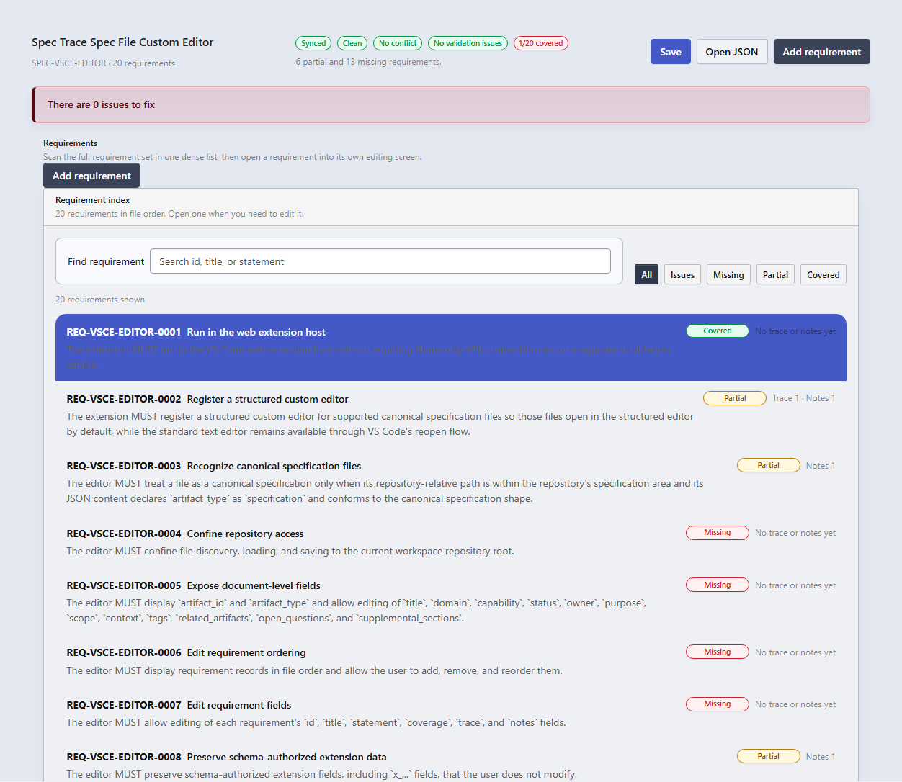
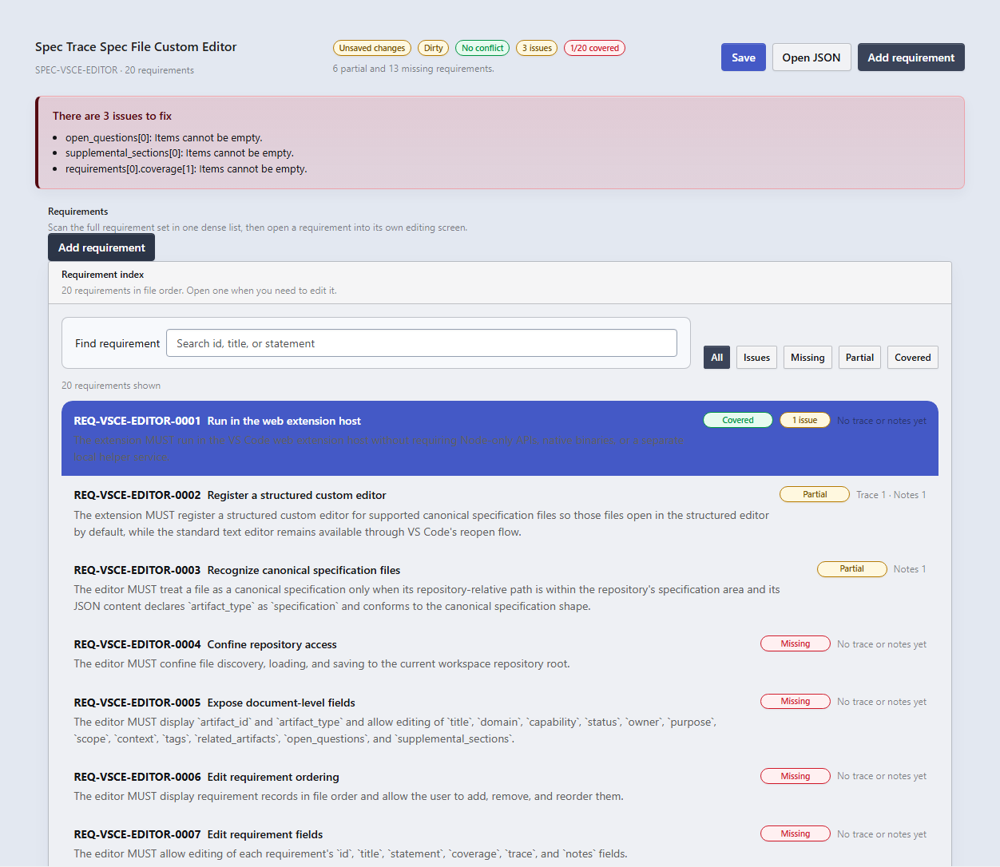

# Spec Trace

Spec Trace is a VS Code web extension for working inside a repository that stores canonical Spec Trace artifacts.

The current preview focuses on two high-value surfaces:

- A repository explorer that groups Spec Trace artifacts by category and domain.
- A dense custom editor for specification JSON files, optimized for scanning many requirements and opening one requirement into a focused editing screen.

## Current Preview

This extension is still in preview. The custom editor and repository explorer are working, but the marketplace metadata and publication pipeline are still being finalized.

## Features

### Repository explorer

- Adds a dedicated `Spec Trace` activity bar container.
- Groups artifacts into:
  - Specifications
  - Architectural Views
  - Work Items
  - Verification Documents
- Expands specification files into individual requirement nodes.
- Opens specification JSON files in the custom editor.
- Reveals a specific requirement directly from the tree.

### Dense specification editor

- Opens `specs/requirements/**/*.json` files in a custom editor.
- Uses the shared `@incursa/ui-kit` surface rather than ad hoc HTML.
- Starts in a browse-first requirement index instead of a noisy card grid.
- Supports search plus `All`, `Issues`, `Missing`, `Partial`, and `Covered` filters.
- Opens a requirement into a focused detail screen for editing.
- Supports previous and next requirement navigation while staying in the detail screen.
- Persists browse and edit state in the webview during reloads.

## Screenshots

### Requirement index


### Filtered requirement browse view



### Focused requirement detail



## Workspace Expectations

The extension assumes a Spec Trace-style repository layout. The current explorer and custom editor are built around paths like:

```text
specs/
  requirements/<domain>/*.json
  architecture/<domain>/*.md
  work-items/<domain>/*.md
  verification/<domain>/*.md
```

## Development

Install dependencies:

```bash
npm install
```

Run the main verification pass:

```bash
npm test
```

Run only the browser smoke coverage for the custom editor UI:

```bash
npm run test:webview
```

Run the extension in a browser-hosted development session:

```bash
npm run run-in-browser
```

## Known Gaps Before Marketplace Release

- The extension manifest still needs a real Marketplace `publisher`.
- The repository, homepage, issue tracker, and license metadata are not finalized yet.
- The release packaging and publish flow still need account-specific credentials and marketplace setup.

## Release Notes

See [CHANGELOG.md](CHANGELOG.md).
